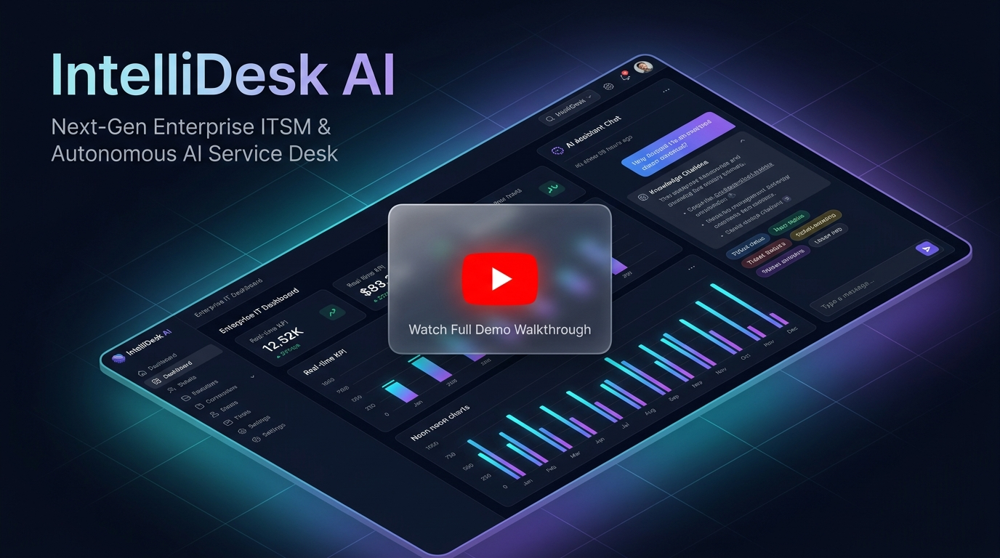

# IntelliDesk AI

> **AI-Powered Enterprise IT Service Management (ITSM) Platform**

[](https://python.org)
[](https://flask.palletsprojects.com)
[](https://react.dev)
[](https://typescriptlang.org)
[](https://postgresql.org)
[](https://docker.com)
[](./LICENSE)

---

## Demo Video

[](https://youtu.be/LGIFagqh4N4)

> **Click the banner above** to watch the full platform walkthrough on YouTube — IntelliBot in action, RAG knowledge retrieval, conversational auto-ticket creation, and the real-time analytics dashboard.

---

## What is IntelliDesk AI?

IntelliDesk AI is a production-grade enterprise ITSM platform that combines intelligent automation with a seamless service desk experience — inspired by **ServiceNow**, **Jira Service Management**, **Zendesk**, and **Microsoft Copilot**.

### Core Capabilities

| Feature | Description |
|---|---|
| **IntelliBot (AI Assistant)** | Context-aware conversational AI with RAG-powered knowledge base retrieval and citation support |
| **Auto Ticket Creation** | Employees raise IT tickets naturally through chat — IntelliBot creates and assigns tickets automatically |
| **Full Ticket Lifecycle** | Create → Assign → Escalate → Resolve → Close with full SLA tracking and audit trail |
| **RAG Knowledge Base** | Upload PDFs/DOCX → auto chunk → embed → semantic vector search with source attribution |
| **Business Intelligence** | Real-time KPIs, SLA compliance charts, agent performance metrics, and workload analytics |
| **Live Real-time Updates** | WebSocket-powered dashboard notifications via Socket.IO |
| **Enterprise RBAC** | 5-tier role system: Super Admin → Manager → Agent → IT Staff → Employee with JWT auth |
| **ITIL-Aligned Management** | Incident, problem, and change management with root cause analysis and timeline tracking |

---

## Tech Stack

| Layer | Technologies |
|---|---|
| **Backend** | Python 3.11, Flask 3, SQLAlchemy 2, Alembic, Marshmallow, Flask-JWT-Extended |
| **Task Queue** | Celery 5, Redis 7, Celery Beat (scheduled tasks) |
| **Real-time** | Flask-SocketIO (WebSockets via eventlet) |
| **Database** | PostgreSQL 16 (Neon) |
| **Vector DB** | ChromaDB |
| **Embeddings** | sentence-transformers/all-MiniLM-L6-v2 (runs locally, no cost) |
| **LLM** | Groq API — Llama 3.3 70B (streaming responses) |
| **Frontend** | React 18, TypeScript, Vite, TailwindCSS |
| **State Management** | Redux Toolkit + TanStack Query |
| **Charts** | Chart.js + react-chartjs-2 |
| **Infrastructure** | Docker, Docker Compose, NGINX, Gunicorn |
| **CI/CD** | GitHub Actions |
| **Hosting** | Render (API) + Vercel (Frontend) + Neon (DB) |

> **Total infrastructure cost: $0/month** using free tiers

---

## Architecture

```
Browser (React SPA)
       │
     NGINX (Reverse Proxy + Rate Limiting)
       │
  Gunicorn / Flask App
       │
 ┌─────┼──────────┬──────────────┐
 ▼     ▼          ▼              ▼
PostgreSQL      Redis         ChromaDB
(Primary DB)  (Cache +      (Vector Store)
              Queue)              │
               │           Sentence Transformers
            Celery              (Embeddings)
           Workers
               │
          Groq API (LLM)
       Llama 3.3 70B (Stream)
```

**Design Patterns:**
- Clean Architecture: `Controller → Service → Repository → Model`
- AI Provider Abstraction: Strategy Pattern (Groq primary, swappable)
- Event-Driven: Socket.IO for live updates

---

## Quick Start (Local Development)

### Prerequisites
- [Docker Desktop](https://www.docker.com/products/docker-desktop/) (running)
- [Node.js 18+](https://nodejs.org/) & npm
- Git
- Free Groq API key → [console.groq.com](https://console.groq.com)

### 1. Clone & Configure

```bash
git clone https://github.com/Pruthviraj-333/intellidesk-ai.git
cd intellidesk-ai

# Copy backend environment template and add your API keys
cp .env.example .env
```

Edit `.env` and set at minimum:
```env
GROQ_API_KEY=your_groq_api_key_here
SECRET_KEY=your_random_secret_key
```

### 2. Start Infrastructure & Backend

Using Make:
```bash
make up       # Starts PostgreSQL, Redis, ChromaDB, Backend, Celery & NGINX
make migrate  # Applies Alembic database migrations
make seed     # Seeds roles, departments, and demo users
```

*Or using Docker Compose directly (PowerShell / Command Prompt):*
```bash
docker compose up -d
docker compose exec backend flask db upgrade
docker compose exec backend flask seed-db
```

### 3. Start Frontend

In a separate terminal:
```bash
# Using Make
make frontend-install
make frontend-dev

# Or using npm directly
cd frontend
npm install
npm run dev
```

### 4. Access the Application

| Service | URL |
|---|---|
| Frontend (UI) | http://localhost:5173 (or http://localhost via NGINX) |
| Backend API | http://localhost:8000/api/v1 |
| Swagger Docs | http://localhost:8000/api/v1/docs |
| Celery Flower | http://localhost:5555 |

### 5. Default Login Credentials

| Role | Email | Password |
|---|---|---|
| Super Admin | admin@intellidesk.ai | Admin@123! |
| Manager | manager@intellidesk.ai | Manager@123! |
| Agent | agent@intellidesk.ai | Agent@123! |
| Employee | employee@intellidesk.ai | Employee@123! |

---

## IntelliBot — AI Chat Assistant

IntelliBot is the conversational AI core of IntelliDesk. Employees interact naturally to:

1. **Ask IT questions** — Wi-Fi setup, VPN config, hardware troubleshooting, software installs
2. **Get instant answers** — RAG retrieves relevant knowledge base articles with source citations
3. **Raise tickets automatically** — If the issue persists, IntelliBot creates and assigns a ticket through conversation without any manual forms
4. **Track ticket status** — Ask IntelliBot for updates on open tickets

**How IntelliBot RAG works:**

```
User Question
     │
Vector Search (ChromaDB)
     │
Top-K Relevant Chunks Retrieved
     │
Groq LLM (Llama 3.3 70B) — Streaming Response
     │
Answer with Citations → User
```

---

## Running Tests & Quality Checks

### Backend Test Suite
```bash
# Run unit and integration tests with coverage
make test
# Or directly via Docker:
docker compose exec backend pytest tests/ -v
```

### Frontend Test Suite
```bash
# Run component and unit tests
make frontend-test
# Or directly via npm:
cd frontend && npm run test
```

### Linting & Formatting
```bash
# Python backend linting (flake8, black, isort)
make lint
make format

# Frontend linting (oxlint)
make frontend-lint
```

---

## Project Structure

```
intellidesk-ai/
├── backend/                  # Flask Python API (Clean Architecture)
│   ├── app/
│   │   ├── controllers/      # HTTP request handlers (Blueprints)
│   │   ├── services/         # Business logic layer
│   │   ├── repositories/     # Data access layer
│   │   ├── models/           # SQLAlchemy ORM models
│   │   ├── schemas/          # Marshmallow serialization/validation
│   │   ├── ai/               # RAG pipeline, LLM abstraction, prompts
│   │   ├── socket/           # Socket.IO event handlers
│   │   └── tasks/            # Celery async task definitions
│   ├── migrations/           # Alembic DB migration scripts
│   ├── tests/                # Unit + integration test suite
│   └── wsgi.py
├── frontend/                 # React 18 TypeScript SPA
│   ├── src/
│   │   ├── pages/            # Dashboard, Tickets, IntelliBot, Analytics
│   │   ├── components/       # Shared UI component library
│   │   ├── store/            # Redux Toolkit slices
│   │   ├── hooks/            # Custom React hooks
│   │   └── services/         # API client & Socket.IO client
├── nginx/                    # NGINX reverse proxy config
├── docs/                     # Complete design documentation
│   ├── 01-SRS/               # Software Requirement Specification
│   ├── 02-Architecture/      # System architecture diagrams
│   ├── 03-Database/          # Database schema design
│   ├── 04-API/               # OpenAPI specification
│   ├── 06-Roadmap/           # Development roadmap
│   └── 07-TechStack/         # Technology justification
├── .github/                  # GitHub Actions CI/CD pipelines
├── docker-compose.yml
├── Makefile
├── .env.example
└── README.md
```

---

## Documentation

All design and architectural documents are in the `docs/` folder:

| Document | Path |
|---|---|
| Software Requirement Specification | [docs/01-SRS/](./docs/01-SRS/README.md) |
| Architecture Design | [docs/02-Architecture/](./docs/02-Architecture/README.md) |
| Database Design | [docs/03-Database/](./docs/03-Database/database-design.md) |
| API Specification | [docs/04-API/](./docs/04-API/README.md) |
| Development Roadmap | [docs/06-Roadmap/](./docs/06-Roadmap/development-roadmap.md) |
| Tech Stack Justification | [docs/07-TechStack/](./docs/07-TechStack/tech-stack-justification.md) |

---

## Engineering Highlights

### Backend Engineering
- Clean Architecture with strict layer separation
- Flask Blueprint-based modular API with 50+ endpoints
- SQLAlchemy ORM — complex relationships, transactions, and migrations
- JWT authentication with refresh token rotation and blacklisting
- Celery async processing with priority queues and retry logic
- WebSocket real-time events with namespace isolation

### AI / ML Engineering
- LLM provider abstraction via Strategy Pattern (Groq → swappable)
- Full RAG pipeline: `extract → chunk → embed → index → retrieve → generate`
- Streaming LLM responses via Server-Sent Events
- Structured JSON output parsing from LLMs
- Semantic similarity scoring and confidence thresholds
- Source citation and attribution in AI responses

### Frontend Engineering
- React 18 SPA with TypeScript — strict typing throughout
- Redux Toolkit + TanStack Query hybrid (server vs. client state)
- JWT interceptors with silent auto-refresh token rotation
- Socket.IO client with reconnection logic and event queuing
- Feature-based modular architecture
- Dark/light mode with system preference detection

### DevOps & Infrastructure
- Multi-stage Docker builds (dev + production targets)
- Docker Compose multi-service orchestration (7 services)
- NGINX as reverse proxy with rate limiting and WebSocket upgrades
- GitHub Actions CI/CD: lint → test → build → deploy
- Health check endpoints for every service
- Structured JSON logging with request correlation IDs

---

## License

MIT License — see [LICENSE](./LICENSE)

---

<p align="center">
  <strong>Built as an enterprise-grade platform demonstrating production software engineering standards.</strong><br/>
  Every design decision documented. Every technology justified. Every pattern intentional.
</p>

<p align="center">
  <a href="https://youtu.be/LGIFagqh4N4">Watch Demo</a> ·
  <a href="./docs/01-SRS/README.md">Documentation</a> ·
  <a href="http://localhost/api/v1/docs">API Reference</a>
</p>
